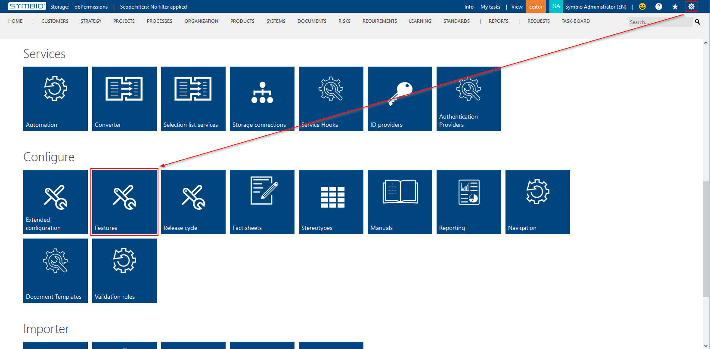
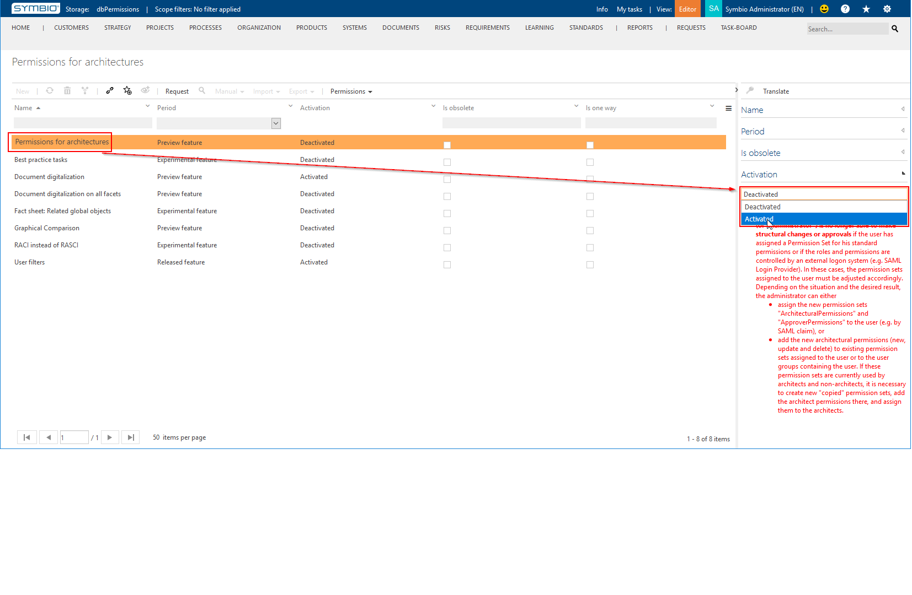

# Permission Levels Explained

Symbio supports several permission levels. Some of them are available as features that need to be activated separately.
Update here.

## General Permissions

* __Show element__: This controls whether an element is visible to a user or not. The element will be shown as a symbol and/or by name if this permission level is granted.
* __Open element__: This controls whether an element can be viewed in detail or not. The element's content, e.g. properties, diagram content, etc., can be viewed if this permission level is granted.
* __Edit element__: If this permission level is granted, a user can not only view but also edit an _already existing_ element's content, e.g. properties, diagram content, etc.
* __New element__: If this permission level is granted, a user can create new elements.
* __Delete element__: If this permission level is granted, a user can delete existing elements.
* __Approve element__: If this permission level is granted, a user can approve changes to an element.

These permission levels are context-sensitive, e.g. you need to be able to switch into "Editor" mode (i.e. you also need at least the role "Editor") to utilize granted Edit/New/Delete/Approve permissions, and they only affect non-architectural elements.

To affect architectural elements you either need to be at least assigned to the role "Architect", or have the feature "Architectural Permissions" activated _and_ and appropriate permission levels assigned (see below).

### Included Permissions

| Permission Level | Includes         |
|------------------|------------------|
| Show element     | -                |
| Open element     | show             |
| Edit element     | show, open       |
| New element      | show, open, edit |
| Delete element   | show, open       |
| Approve element  | show, open       |

## Architectural Permissions

These permissions affect architectural elements, e.g. Process House, Sub Categories, Main Processes, Risk Domains, etc.

* __Edit architectural element__: If this permission level is granted, a user can not only view but also edit an _already existing_ architectural element's content, e.g. properties, diagram content, etc.
* __New architectural element__: If this permission level is granted, a user can create new architectural elements.
* __Delete architectural element__: If this permission level is granted, a user can delete existing architectural elements.

### Included Permissions

| Permission Level             | Architectural Includes | General Includes      |
|------------------------------|------------------------|-----------------------|
| Edit architectural element   | -                      | show, open, edit      |
| New architectural element    | edit                   | show, open, edit, new |
| Delete architectural element | -                      | show, open, delete    |

### Activating the Feature "Architectural Permissions"

__You need to be an Administrator to activate this feature.__

* Go to the Admin area in Symbio and click on "Features":
  

* Select "Architectural Permissions" and change "Activation" to "Activated":
  

_Please note the consequences of activating this feature; read the explanation under "Activation" carefully._
