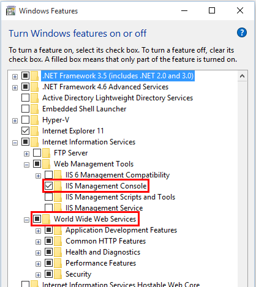
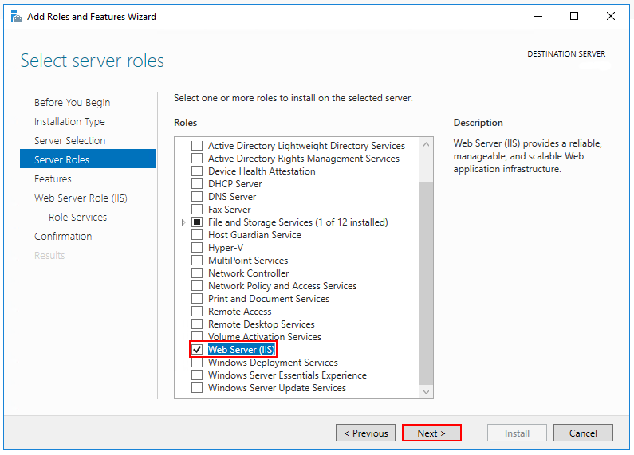
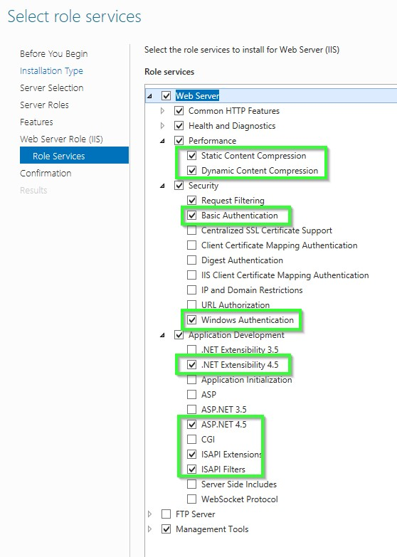
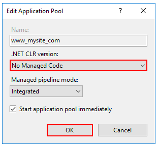
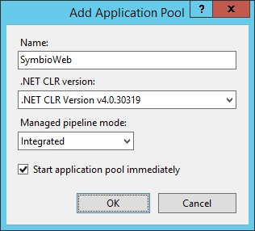
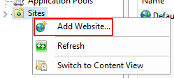
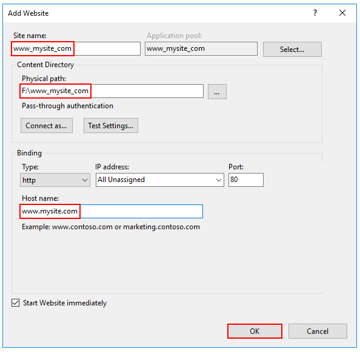

# Installation of the Internet Information Services (IIS)

Enable the Web Server (IIS) role and establish role services.

- Windows Server

## Windows desktop operating systems

Navigate to **Control Panel** > **Programs** > **Programs and Features** > **Turn Windows features on or off** (left side of the screen). Open the group for **Internet Information Services** and **Web Management Tools**. Check the box for **IIS Management Console**. Check the box for **World Wide Web Services**. Accept the default features for **World Wide Web Services** or customize the IIS features to suit your needs.

## Windows Server operating systems

For server operating systems, use the **Add Roles and Features** wizard via the **Manage** menu or the link in **Server Manager**. On the **Server Roles** step, check the box for **Web Server (IIS)**.

On the **Role services** step, select the IIS role services you desire or accept the default role services provided.

Proceed through the **Confirmation** step to install the web server role and services. A server/IIS restart is not required after installing the Web Server (IIS) role.

---

## Create the IIS Website

1. Start the Internet Information Server (IIS)

### This is how you start IIS-Manager in the dialogue field &quot;Execute&quot;

1. On the **Start** menu, click **All Programs** , click **Accessories** , and then click **Run**.
2. In the **Open** box, type **inetmgr** and then click **OK**

### This is how you start IIS-Manager from the Administrative Services console

1. On the **Start** menu, click **All Programs** , click **Accessories** , and then click **Run**.
2. In the **Run** text box, type **control panel** , and then click **OK**.
3. In the **Control Panel** window, click **Classic View** , and then double-click **Administrative Tools**.
4. In the **Administrative Tools** window, double-click **Internet Information Services**.

### This is how you create an application pool on a web server

1. In the **Connections** pane please expand the server name and click on  **application pools**.
2. On the page  **Application pools**  please click on **Add application pool** in the **Actions**
3. In the dialogue field **Add application pool** please enter a unique name for the application pool in the field **Name**. Or right click on the area and select the option 'Add Application Pool...'

    

    A new dialog opens. Maintain the following values.
    1. In the List  **.NET Framework-Version**  please select the following .NET Framework version: NET CLR Version v4.0.x
    2. From the list **Managed pipeline mode** please select the **Integrated** , if you want to use the pipeline integrated in IIS und ASP.NET. Select **No Managed Code** if you install an Microservice for Symbio. ASP.NET Core runs in a separate process and manages the runtime.

4. Please select  **Start application pool immediately** to start the application pool whenever the www service is started. This option is activated by default.
5. Click on  **OK**.

     

### This is how you add a website

1. In the **Connections**  pane please right-click the node **Sites**  in the tree and then click on **Add**** Web Site**. Or right click on the area and select the option 'Add Website'.

   

2. In the dialogue field  **Add**** Web Site** please enter a name for the website in the **Website name** box.
3. Click on  In the dialogue field  **Select application pool** please select the application pool which you have created in the previous section and then click on  **OK**.
4. In the field  **Physical path**  please type the physical path of the Web site&#39;s folder, or click the browse button ( **...** ) to navigate the file system to find the folder.
5. If the physical path that you entered is to a remote share, click **Connect as** to specify credentials that have permission to access the path. If you do not use specific credentials, select the **Application user (pass-through authentication)** option in the **Connect As** dialog box.
6. Select the protocol for the Web site from the **Type** list.
7. The default value in the **IP address** box is **All Unassigned**. If you must specify a static IP address for the Web site, type the IP address in the **IP address** box.
8. Type a port number in the **Port** text box.
9. Optionally, type a host header name for the Web site in the **Host Header** box.
10. If you do not have to make any changes to the site, and you want the Web site to be immediately available, select the **Start Web site immediately** check box.
11. Click  **OK**.

   

### Recommendation

Create for each environment (Test and Prod) a website.