# Sub Process diagram elements Synchronization
---
### Warning
#####  Currently the sub process sychrnoization doesnt work, and the fix from the SAP is waited in order for this functionality to work.
---

In this article you will be introduced with the basic rules of how the synchrnoization of sub process diagram elements is working.

## Synchronizing sub process diagram element from Symbio to SolMan

A sub process in Symbio can have multiple forms. Depending on how it is modeled in Symbio the synchrnoization of it to SolMan will work differently.
In the nex table you will see a biref explanation of all cases that will be explained in more detail.

| Symbio element | SolMan element |
| ------ | ------ |
| Interface | Empty sub process |
| Empty sub process | Empty sub process |
| Sub process with nested diagram | Referenced sub process with a new diagram |
| Reference sub process | Referenced sub process |

### 1.Interface

In Symbio interface is just a placeholder that will in future become a sub process reference. When the interface is synchronized it will becoe an empty sub process in SolMan.

---

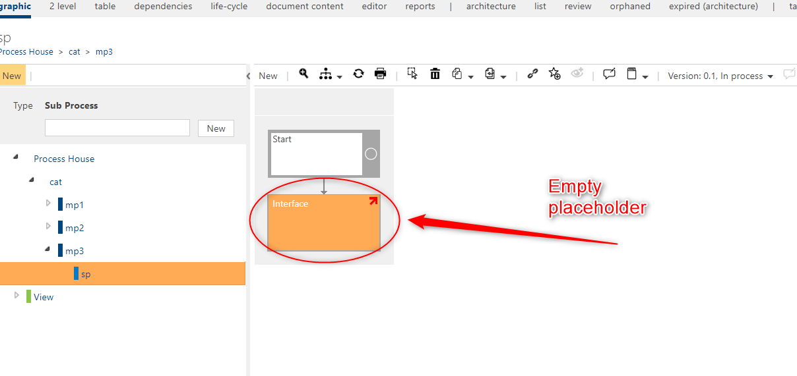

---

After synchronizing the interface should look like this

---

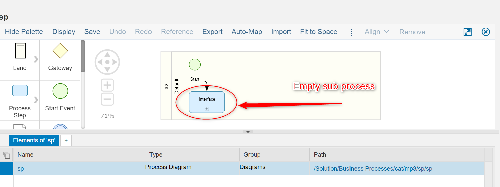

---

### 2. Empty Sub Process

In Symbio the user can create an empty sub process. That is a sub process that doesnt have any nested diagram and also doesnt have references to other sub processes in the structure. 

---

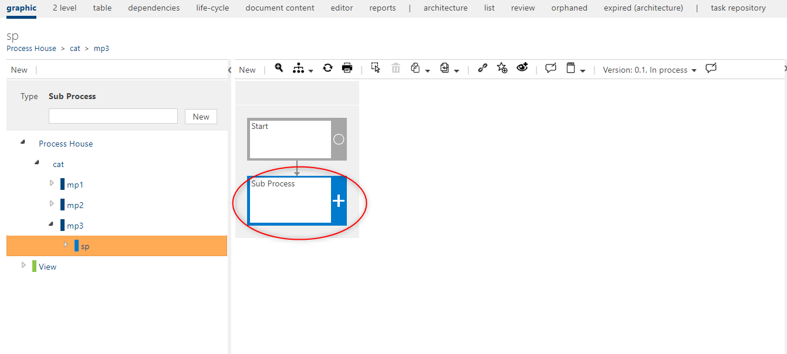

---

When this element is synchronized to SolMan it will also be an empty sub process.

---

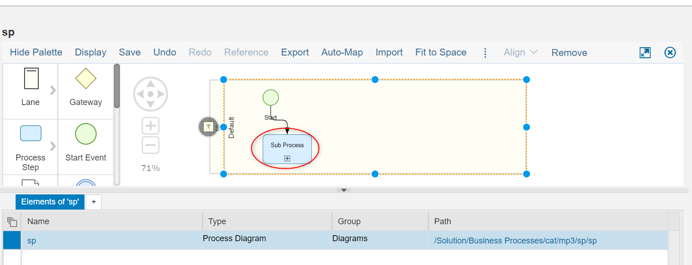

---

### 3.Nested Sub Process
In Symbio the user can create a nested sub process. That is a sub process that has a nested diagram with elements.

---

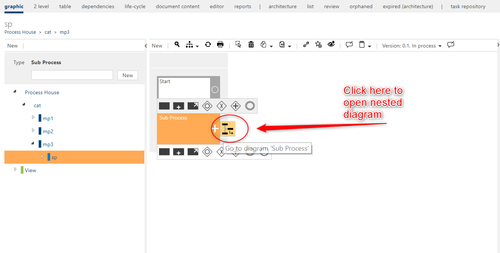

---

This sub process has a diagram with elements.

---

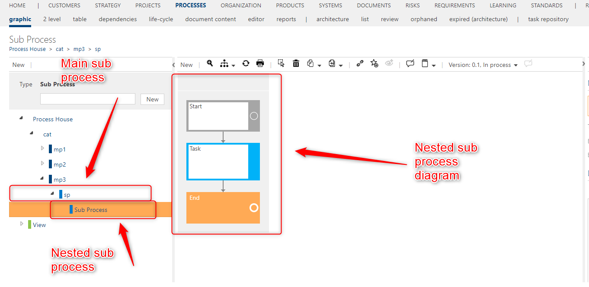

---

In SolMan one sub process cannot have another sub process as a child so the nested sub process will not synchronized, only its diagram will be added as a diagram of the main sub process.

---

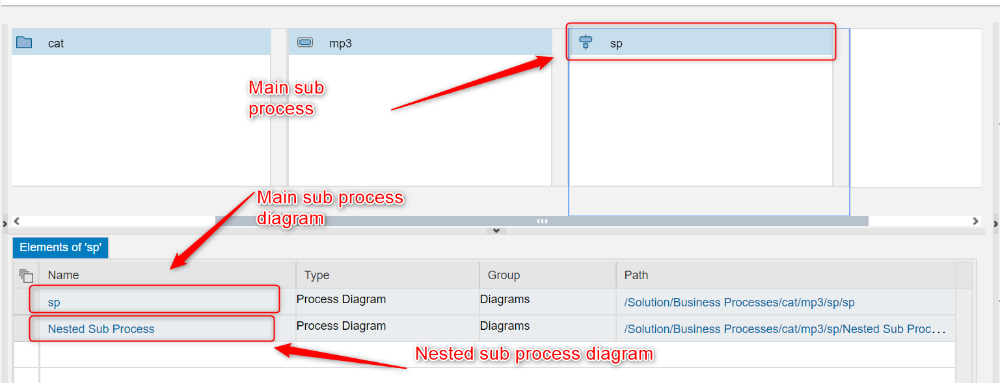

---

The nested diagram element should have a reference to a nested diagram.

---

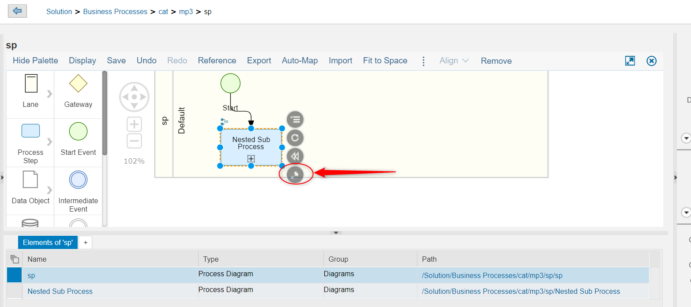

---

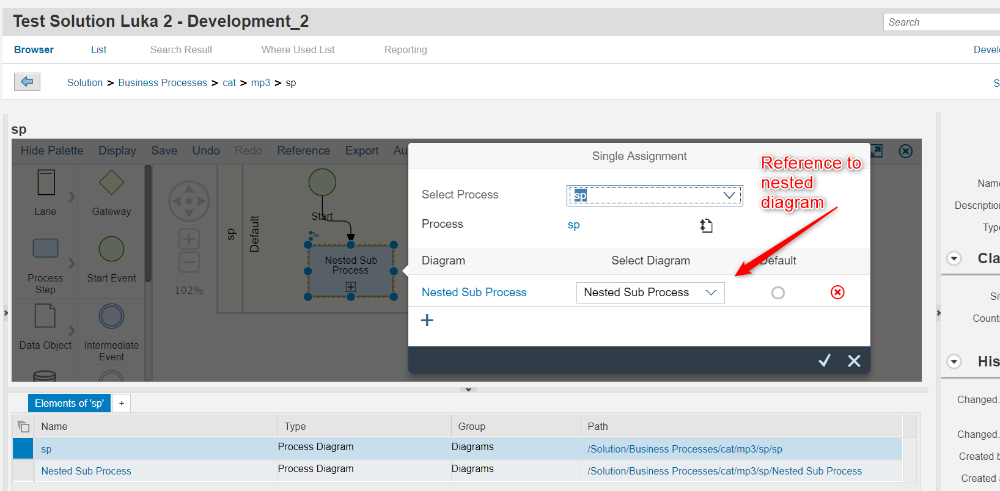

---

**Tips**

1.You cannot synchrnoize a sub process that has a sub process as a parent

---

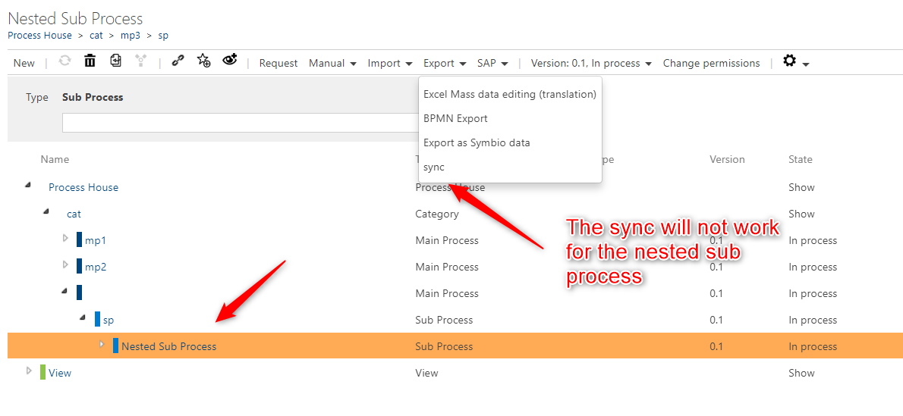

---

2.You can have more levels of nested sub processes. Every nested sub process will result in a new diagram attached to the main sub process

---

### 4.Sub process references

In Symbio a user can create a diagram element that holds a reference to another sub process in the structure.

---

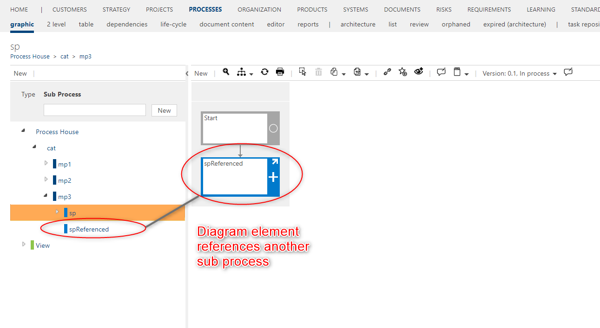

---

Wehn this element is synchronized in SolMan it will also be a sub process with a reference. A scepial link attribute will be added to the sub process.

---

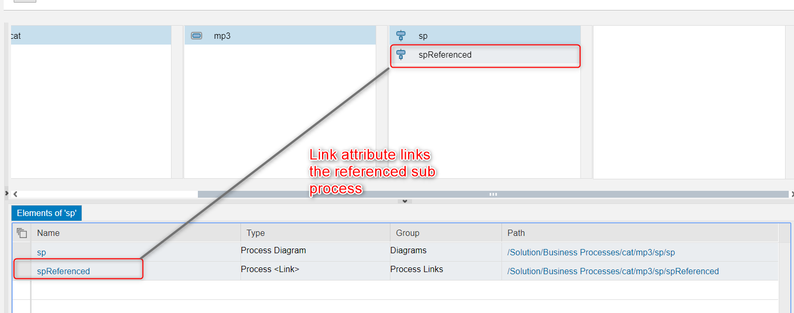

---

The diagram element should contain also a reference to the referenced sub process

---

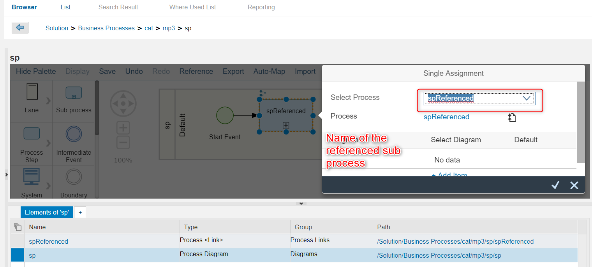

---

**Tips**
1. All the referenced sub processes will also be synchronized with its root path 